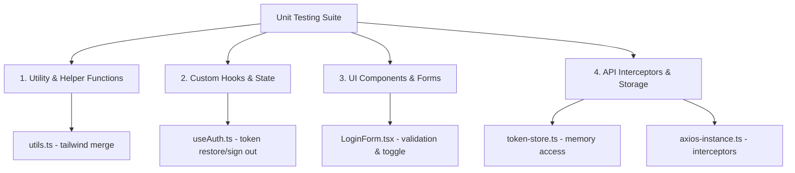

# UniCare Frontend Unit Testing Plan

This document outlines the strategy, architecture, and step-by-step setup to establish a robust unit testing suite for the UniCare Next.js frontend application.

---

## 1. Core Testing Stack

We recommend **Vitest** over Jest for this project due to its native ES modules (ESM) support, fast execution speed via workers, seamless Vite-compatible config, and excellent integration with Next.js 15+ and React 19.

| Tool | Purpose | Rationale |
| :--- | :--- | :--- |
| **Vitest** | Test runner & assertion library | Fast, modern, zero-config typescript compilation, Jest-compatible API. |
| **jsdom** | Browser environment simulation | Runs DOM tests in Node without the overhead of a real browser. |
| **React Testing Library** | Component rendering & queries | Encourages testing user behavior and accessibility rather than implementation details. |
| **user-event** | Event simulation | Simulates real browser interactions (clicks, typing) more accurately than `fireEvent`. |
| **MSW (Mock Service Worker)** | API request mocking | Intercepts HTTP requests at the network level, keeping Axios interceptors and APIs intact. |

---

## 2. Configuration & Infrastructure Setup

We will introduce a few configuration files in the root of `unicare/`.

### Dependencies to Install
```bash
npm install -D vitest @vitejs/plugin-react jsdom @testing-library/react @testing-library/jest-dom @testing-library/user-event msw
```

### Proposed `vitest.config.ts`
This configures Vitest to resolve paths using `@/*` aliases and sets up the test environment.
```typescript
import { defineConfig } from "vitest/config";
import react from "@vitejs/plugin-react";
import path from "path";

export default defineConfig({
  plugins: [react()],
  test: {
    environment: "jsdom",
    globals: true,
    setupFiles: "./src/test/setup.ts",
    alias: {
      "@": path.resolve(__dirname, "./src"),
    },
  },
});
```

### Proposed Test Setup File (`src/test/setup.ts`)
This file runs before every test suite. It configures standard mocks and cleans up state.
```typescript
import "@testing-library/jest-dom";
import { cleanup } from "@testing-library/react";
import { afterEach, vi } from "vitest";

// Automatically cleanup DOM after each test
afterEach(() => {
  cleanup();
});

// Mock next/navigation & custom localized routing hooks
vi.mock("@/i18n/routing", () => ({
  useRouter: () => ({
    push: vi.fn(),
    replace: vi.fn(),
    back: vi.fn(),
  }),
  usePathname: () => "/en",
}));

// Mock toast notifications
vi.mock("sonner", () => ({
  toast: {
    success: vi.fn(),
    error: vi.fn(),
  },
}));
```

---

## 3. What to Test: Target Areas & Strategies

Based on the structure of `src/`, here is the breakdown of what we need to test and how:



### A. Testing API Clients & Auth State Management
Files: `src/api/token-store.ts`, `src/api/axios-instance.ts`

- **`token-store`**: Test that the token is set correctly, retrieved, and cleared in memory.
- **`axios-instance`**: Mock Axios requests to verify that the interceptor correctly appends the `Authorization: Bearer <token>` header if a token is in memory, and handles errors.

**Example Test Plan for `token-store.test.ts`**:
```typescript
import { getAuthToken, setAuthToken, clearAuthToken } from "./token-store";

describe("Token Store", () => {
  beforeEach(() => {
    clearAuthToken();
  });

  it("should return null initially", () => {
    expect(getAuthToken()).toBeNull();
  });

  it("should set and get token", () => {
    setAuthToken("test-token");
    expect(getAuthToken()).toBe("test-token");
  });

  it("should clear token", () => {
    setAuthToken("test-token");
    clearAuthToken();
    expect(getAuthToken()).toBeNull();
  });
});
```

### B. Testing Reusable Hooks
File: `src/hooks/useAuth.ts`

The `useAuth` hook uses React Query and fetch requests. We should mock the fetch endpoints and wrap tests in a custom QueryClientProvider to verify:
- In-memory token restoration from `/api/auth/token` on load.
- Profile fetching if token is present.
- Sign out cleaning up token store and Query Cache.

### C. Testing Forms & UI Components
File: `src/components/auth/login-form.tsx`

`LoginForm` features to test:
1. **Initial Rendering**: Verify "Via Email" is selected by default, displaying the email input field.
2. **Switching Context**: Clicking "Via Phone" switches input type to phone number with `+20` prefix.
3. **Form Validation (Zod)**:
   - Entering invalid email displays corresponding Zod validation error.
   - Entering invalid phone number displays corresponding error.
   - Entering short password displays validation warning.
4. **Form Submission**:
   - Submitting valid credentials triggers `authApi.login` with formatted values.
   - Successful response sets auth token, invalidates user query, fires toast success, and pushes redirect routing.
   - Failed response fires toast error and displays submit error.

---

## 4. Proposed Road Map / Next Steps

1. **Step 1**: Install dev dependencies and setup directories (`src/test`).
2. **Step 2**: Create `vitest.config.ts` and `src/test/setup.ts`.
3. **Step 3**: Implement basic tests for utilities and `token-store.ts` to verify setup works.
4. **Step 4**: Implement unit tests for the Axios interceptors (`src/api/axios-instance.ts`).
5. **Step 5**: Write hooks test setup and tests for `useAuth.ts`.
6. **Step 6**: Implement tests for UI Components (beginning with forms like `LoginForm` and `CreateAccountForm`).
7. **Step 7**: Update `package.json` to include `"test": "vitest"` and `"test:run": "vitest run"`.
